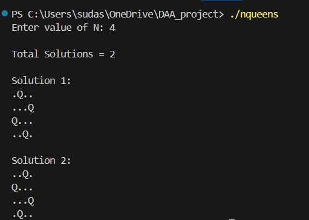

♟️ N-Queens Problem — Backtracking Algorithm (C++)

This project implements the N-Queens problem using the backtracking algorithm in C++ with a Command Line Interface (CLI).

The N-Queens problem involves placing N queens on an N×N chessboard such that no two queens attack each other.
This means:
No two queens share the same row
No two queens share the same column
No two queens share the same diagonal

The program takes the value of N as input from the user, computes all valid solutions, and prints each solution directly to the terminal using an intuitive board representation.

Technologies Used
Language: C++
Paradigm: Backtracking / Recursion
Interface: Command Line Interface (CLI)
Compiler: g++ (MinGW / GCC)

Algorithm Used
The solution uses the Backtracking technique.
Key Steps:
Place a queen in a safe column of the current row.
Recursively move to the next row.
If no safe position exists, backtrack to the previous row.
Continue until all solutions are explored.
This ensures that only valid board configurations are generated.

Time Complexity: 
𝑂(𝑁!)
Space Complexity: 
𝑂(𝑁 ^ 2)

Program Output:

Applications:
Scheduling problems – conflict-free task and resource allocation
VLSI design – placement of components with minimal interference
Artificial Intelligence – constraint satisfaction problems (CSPs)
Robotics – constraint-based path planning